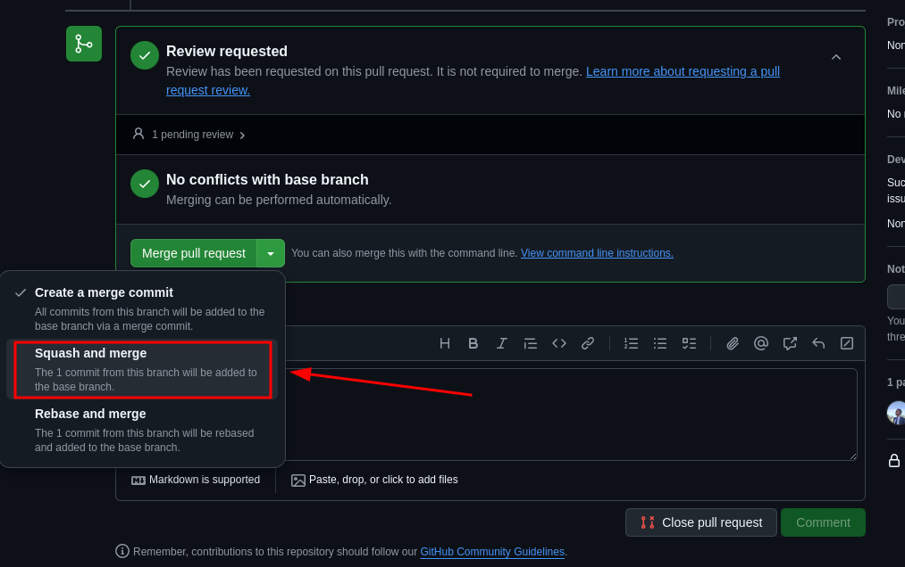

# 1TDSR


Bom dia/Boa tade/Boa noite, equipe 1TDSR.


Criamos esta pasta com o objetivo de organizar as informações extraídas em nossas aulas, como códigos, slides e imagens, permitindo que todos possamos nos manter atualizados sobre o conteúdo que estamos aprendendo.


____________________________________________________________

## possiveis duvidas que vocês possam ter

1 - O que vamos aprender juntos neste repositório?


2 - Quais são os próximos passos e como podemos contribuir aqui?


3 - Qual é o propósito deste GitHub e como ele pode ajudar no nosso aprendizado?


____________________________________________________________

1 - Como mencionado na 'Introdução', vamos disponibilizar aqui no nosso GitHub tudo o que estamos aprendendo em sala de aula, seja por meio de conteúdos apresentados em slides ou anotações feitas em nossas maquinas. 
Dessa forma, ao unirmos nossos conhecimentos e anotações em uma única plataforma, como o GitHub, todos poderão se manter atualizados sobre os conteúdos, e ninguém ficará para trás

2 - Aqui, faremos a postagem de slides, imagens e informações extraídas em sala de aula. 
Se você já tem anotações importantes sobre os conteúdos que aprendemos e acredita que elas possam ser úteis para o nosso GitHub, sinta-se à vontade para compartilhá-las. 
Sua contribuição é sempre muito bem-vinda e fará a diferença para mim e para todos que acompanham o projeto

3 - Este GitHub serve como uma plataforma de estudo, reunindo o conhecimento e as informações de cada um de nós. Nele, teremos um ambiente completo com todos os materiais necessários para o nosso aprendizado.
___________________________________________________________


## Oque sera aplicado aqui dentro:

Para o seu interesse, aqui dentro sera aplicado: Codigos, imagens, textos, documentos e etc...

_______________________________________________________

## gostaria de fazer um comentario?

Se quiser contribuir com algo, faça um Pull Request (PR) e adicione o que considerar relevante para facilitar a interpretação, a execução ou que seja crucial para o projeto.
Caso não saiba como criar um Pull Request, desça mais um pouco sua tela do navegador, que mais a baixo, terá o passo a passo de como criar uma pull request.


Caso tenha alguma dúvida, entre em contato com o responsável da página.


Juntos ao topo 1TDSR !!!

_______________________________________________________


----

## Recomendações de atualizações:

### No terminal

1. Fazer o clone na sua máquina

```bash
git clone git@github.com:Japitu/1TDSR.git
```

2. Entrar na pasta 1TDSR

```bash
cd 1TDSR
``` 

3. Caso já tenha a pasta na sua maquina, antes de começar a trabalhar, certifique-se de que está na `main`, faça um Pull do repositório:

```bash
git pull
```

Assim irá atualizar o seu repositório local com o repositótio no GitHub

4. Criar uma branch para trabalhar na atualização. O nome da branch tem a ver com a tarefa que será feita

``` bash
git checkout -b <nome-da-sua-branch>
```

5. Faça as alterações necessárias. Após terminar, faça o commit 

```bash
git add .
git commit -m 'Nome da mensagem'
```

6. Fazer o push para o repositório, porém pela branch que foi criada. Não volte para `main`.

```bash
git push origin <nome-da-sua-branch>
```

7. Após **finalizar** o passo 8 do processo do **GitHub**. Volte para a `main` e pode apagar a branch onde estava trabalhando.

```bash
git checkout main
git branch -D <nome-da-sua-branch>
```
<br>

---

### No GitHub

1. Acesse o repositório no GitHub. Após fazer o push verá a tela abaixo. Clique em **Compare & pull request**.


2. Prencha o título e adicione uma descrição se achar necessário

3. Solicite a revisão de um dos responsáveis


4. Só clicar em **Create pull request**.

5. Aguarde a aprovação do PR (Pull Request):


6. Clique em **Squash and merge** para fazer o Merge.




7. Caso queira, pode alterar a mensagem do commit do merge ou adicionar um descrição. Após isso, só confirmar o merge.


8. Se tudo der certo, verá uma tela parecida com a que está abaixo. Significa que deu tudo certo. Pode clicar em **Deletar branch**.


